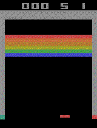

# Projet d'apprentissage par renforcement sur le casse-brique d'ATARI

Ce projet va consister à implémenter un agent dont la politique d'action repose sur un réseau de neurone profond entrainé sur les expériences passées.

## Contenu du projet

- [Notebook](./RL-DQN.ipynb)
- [images produites](./img)

[Lien du repo public](https://github.com/Bast-94/RL-DQN)
